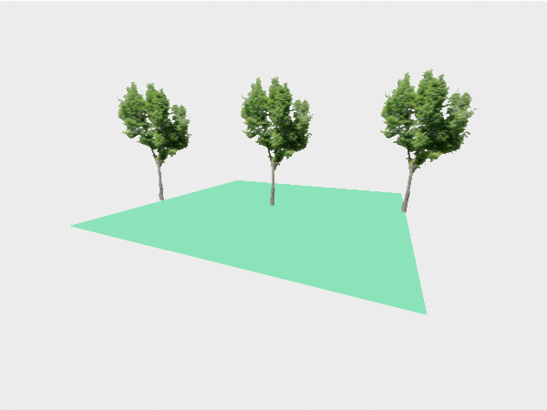

# aframe-vertical-billboard-component #

a simple vertical "billboard" component and primitive for A-Frame

Three.js [Sprites](https://threejs.org/docs/#api/en/objects/Sprite) are planes which always face the camera - but sometimes, the vertical axis of such objects should keep pointing upwards, regardless of the current camera position: that's what "billboards" are good for.

`aframe-vertical-billboard-component` implements a simple vertically oriented billboard component and primitive for [A-Frame](https://github.com/aframevr/aframe/).



**NPM users**: please consider the [Github README](https://github.com/rozek/aframe-vertical-billboard-component/blob/main/README.md) for the latest description of this package (as updating the docs would otherwise always require a new NPM package version)

> Just a small note: if you like this work and plan to use it, consider "starring" this repository (you will find the "Star" button on the top right of this page), so that I know which of my repositories to take most care of.

## Installation ##

`aframe-vertical-billboard-component` may be used as an ECMAScript module (ESM) or explicitly loaded after the `<script>` tag for A-Frame itself.

For the ESM variant, install the package into your build environment using [NPM](https://docs.npmjs.com/) with the command

```
npm install aframe-vertical-billboard-component
```

and `import` it into your code whereever needed

```javascript
import "aframe-vertical-billboard-component"
```

Otherwise, load the plain script file directly

```html
<script src="https://unpkg.com/aframe-vertical-billboard-component"></script>
```

## Properties ##

`aframe-vertical-billboard-component` is an A-Frame component with the following properties:

<table>
 <tbody>
  <tr><th>Properties</th><th>Description</th></tr>
 </tbody>
 <tbody>
  <tr><td>map</td><td>either the id or the URL of an image which will be mapped onto the billboard</td></tr>
  <tr><td>width</td><td>the billboard's width or 0</td></tr>
  <tr><td>height</td><td>the billboard's height or 0</td></tr>
 </tbody>
</table>

Additionally, this module defines an A-Frame primitive named `a-billboard` for this component which maps its attributes `map`, `width` and `height` to component properties of the same name (see usage below)

## Usage ##

Once loaded or imported, `aframe-vertical-billboard-component` may be used as a component of a plain A-Frame entity

```html
<a-scene>
  <a-assets>
    
  </a-assets>
  <a-entity billboard="map:#BillboardTexture; height:2" position="0 0 0"></a-entity>
</a-scene>
```

Without a valid `map`, the billboard will remain invisible. If one of `width` or `height` is 0, its value will be computed from the other setting (which should therefore be > 0) and the natural aspect ratio of the map (if both values are 0, the `height` will be set to 1)

Since billboards are naturally vertical objects, their `position` will not specify their center, but the middle of their lower edge - this helps positioning them programmatically.

### Primitive ###

Alternatively, the primitive `a-billboard` may be used in order to get a more compact code:

```html
<a-scene>
  <a-assets>
    
  </a-assets>
  <a-billboard map="#BillboardTexture" height="2" position="0 0 0"></a-billboard>
</a-scene>
```

## Example ##

Here is a complete example (albeit without the HTML boilerplate)

```html
<script src="https://unpkg.com/aframe"></script>
<script src="https://unpkg.com/aframe-hemisphere-controls"></script>
<script src="https://unpkg.com/aframe-vertical-billboard-component"></script>

<a-scene embedded
  hemisphere-controls="position:0 0.5 4; target:0 1 0"
  style="width:600px; height:450px"
>
  <a-assets>
    
  </a-assets>

  <a-sky color="#555555"></a-sky>

  <a-plane width="1000" height="1000" color="#555555"
    position="0 0 0" rotation="-90 0 0"></a-plane>

  <a-billboard map="#Tree" height="2" position="-2 0 0.5"></a-billboard>
  <a-billboard map="#Tree" height="2" position=" 0 0 0"></a-billboard>
  <a-billboard map="#Tree" height="2" position=" 2 0 -0.5"></a-billboard>
</a-scene>
```

The tree texture was made by Krzysztof Czerwiński, taken from [the freebies section of his blog](http://trzyde.blogspot.com/p/freebies_5.html) and scaled down in order to save resources - it is [free even for commercial use](https://trzyde.blogspot.com/p/license.html).

## Build Instructions ##

You may easily build this package yourself.

Just install [NPM](https://docs.npmjs.com/) according to the instructions for your platform and follow these steps:

1. either clone this repository using [git](https://git-scm.com/) or [download a ZIP archive](https://github.com/rozek/aframe-vertical-billboard-component/archive/refs/heads/main.zip) with its contents to your disk and unpack it there 
2. open a shell and navigate to the root directory of this repository
3. run `npm install` in order to install the complete build environment
4. execute `npm run build` to create a new build

You may also look into the author's [build-configuration-study](https://github.com/rozek/build-configuration-study) for a general description of his build environment.

## License ##

[MIT License](LICENSE.md)
